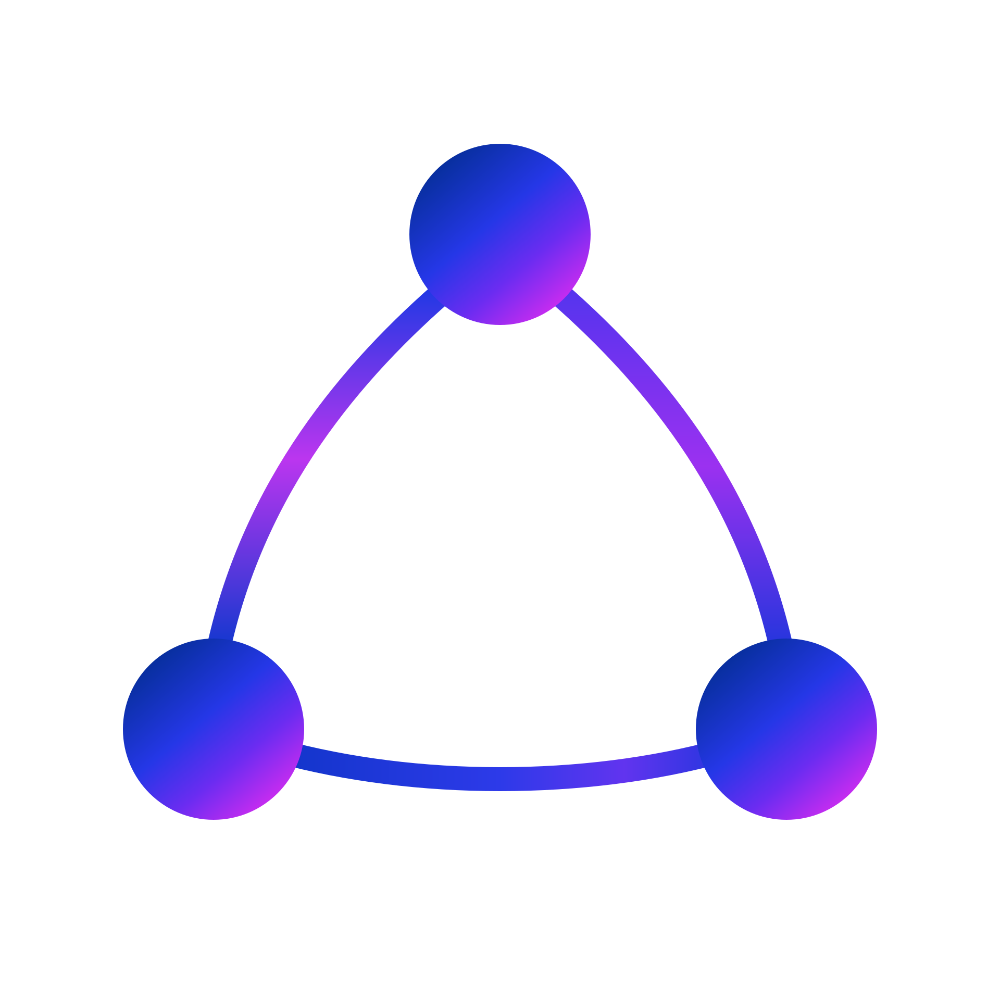

<p align="center">
  
</p>

<h1 align="center">Aegora</h1>

[English](./README.md)

**企业级 Agent 控制平面与无状态运行时**

Aegora 是一个面向企业场景的 AI Agent 平台，用于注册、治理、组合和运行 Agent、MCP 工具、工作流与组织级 Skill。仓库采用 Monorepo 组织，同时保持控制平面与运行时数据平面可独立部署。

## 架构

下图描述的是 **目标生产架构**。PostgreSQL 始终是控制面事实源；Redis、Runtime 本地缓存、LiteLLM 路由和数据飞轮属于可演进的运行/治理层，不改变事实所有权。

```text
                           Aegora 控制平面
                  Agent / Release / RBAC / Registry
                                  |
                                  v
                            PostgreSQL
                           控制面事实源
                                  |
                                  v
                               Redis
                      配置 L2 / 事件 / 失效通知
                                  |
                    +-------------+-------------+
                    |             |             |
                    v             v             v
               Runtime Pod 1 Runtime Pod 2 Runtime Pod 3
                 L1 Cache      L1 Cache      L1 Cache
                 MCP Pool      MCP Pool      MCP Pool
                    |             |             |
                    +-------------+-------------+
                                  |
                                  v
                            LiteLLM Proxy
                                  |
                         Router / Retry / Fallback
                                  |
                                  v
                           Model Providers
                                  |
                                  v
                         Prompt / KV Cache
```

### Runtime 与缓存分层

Runtime 在持久业务事实和配置事实层面保持无状态，但允许保存 **可丢弃、可重建的加速状态**：

- **PostgreSQL — 唯一事实源**：保存 Agent 草稿/不可变 Release、RBAC、能力状态、MCP 注册信息、学习策略、审计记录等持久控制面数据。
- **Redis — 共享 L2 与事件层（目标能力）**：承载带版本号的 Runtime Context 缓存、失效/版本事件等可重建共享状态。Redis 不承担权威配置数据库职责。
- **Runtime L1 — 进程内热点缓存**：缓存解析后的 Release/Runtime Context 等热点数据，使用版本化 Key 让发布或策略变化后的旧缓存自然失配。
- **MCP Pool — 进程内连接复用**：每个 Runtime Pod 可复用 MCP Session/Connection，但池状态可随时丢弃并在重启后重建。
- **LiteLLM Proxy — 统一模型网关**：Runtime 与 Control Plane 统一通过 OpenAI-compatible 接口使用稳定的 `aegora-chat` / `aegora-fast` 别名，真实 Provider Key 与具体模型名收敛在 LiteLLM 后方；`deploy/` 已包含 Staging 部署接线。
- **Langfuse — Agent/LLM 可观测性**：Runtime 可选创建携带 Aegora trace/session/user 上下文的根 Span，LiteLLM 再通过 Langfuse OTEL 上报模型 Generation，使 Agent 执行与 token、延迟、成本等模型数据能够关联。
- **Prompt/KV Cache — 推理优化层（可选）**：仅用于降低推理成本和延迟，不能成为鉴权或业务状态来源。

目标配置读取链路是 **PostgreSQL -> Redis L2 -> Runtime L1**。Agent 发布、禁用或权限/策略变化时推进版本并发送失效事件；Runtime 在版本变化或缓存 Miss 后重新解析，而不是依赖长 TTL 保证正确性。

### 设计原则

- **控制面 / Runtime 分离**：配置与治理归控制面；生产执行归 Runtime，控制面不进入推理热路径。
- **业务执行无状态**：Runtime 可持有可丢弃的本地缓存和 MCP 连接池，但持久事实必须外置。
- **Release 驱动执行**：不可变 Agent Release 定义能力上限，运行时鉴权只能收紧，不能扩大该上限。
- **动态鉴权**：每次执行都取 Release 能力、当前能力状态、当前用户权限/Scope 的交集。
- **面向能力集成**：MCP 是主要工具协议；复杂 SOP/Workflow 应作为受治理能力暴露，而不是直接泄露底层 API。
- **集中配置**：控制面与 Runtime 默认读取仓库根目录 `.env`；真实密钥禁止提交到仓库。

## 受治理的数据飞轮

Aegora 将运行经验视为 **候选改进素材**，而不是允许 Agent 在生产环境中静默自我修改。

```text
生产运行 / Trace / 人工反馈
             |
             v
       评测 + 失败样本挖掘
             |
             v
 Reflection / Skill Draft / 变更提案
             |
             v
   策略门禁 + 人工审核 + 审计留痕
             |
       +-----+------+
       |            |
       v            v
  版本化 Skill   Agent/Prompt 变更
       |            |
       +-----+------+
             |
             v
       离线评测 / Canary
             |
             v
         发布新版本
             |
             v
        新一轮生产运行
```

### 数据飞轮治理约束

- **证据与可执行变更分离**：Trace、反馈和评测可以生成提案，但提案本身不能直接修改生产行为。
- **可发布内容全部版本化**：Skill、Prompt、策略与 Agent Release 一旦发布即不可变，支持复现、审计和回滚。
- **先策略、后晋级**：按 Agent 配置学习策略，明确哪些数据可自动进入学习流程、哪些必须人工审核、哪些禁止学习。
- **质量门禁**：候选变更在发布前经过离线回归/评测；高风险变更可进一步走 Canary。
- **完整血缘**：保留来源 Run/证据、评测结果、变更提案、策略/人工决策以及最终生成版本之间的关联。
- **学习不能扩大权限**：新 Skill 或 Prompt 无法绕过已发布 Release 的能力上限，也不能绕过 Runtime 当前动态鉴权结果。

当前代码已经具备该方向的基础：不可变 Release、Runtime 动态策略解析、审计/治理边界、Skill 机制、已有的 Reflection / Skill Draft 路径，以及统一 LiteLLM Gateway 与 Langfuse Trace 关联。完整自动化数据飞轮和 Redis L2 事件层在对应实现落地前仍属于 **目标架构 / Roadmap**。

## 仓库结构

```text
Aegora/
├─ apps/control-plane/        # FastAPI 控制面 + React/Vite 控制台
├─ services/runtime/          # 无状态 Agent Runtime
├─ packages/config/           # 共享配置约定
├─ packages/contracts/        # 跨平面版本化契约
├─ deploy/                    # 仓库级部署边界
├─ docs/                      # 架构与迁移文档
├─ .env.example               # 统一配置模板
├─ README.md
└─ README_CN.md
```

## 本地开发

```bash
cp .env.example .env

# 配置 LITELLM_* 上游模型参数；启用 Trace 时再配置 Langfuse Key。
python -m pip install "litellm[proxy]"
litellm --config deploy/litellm-config.yaml --port 4000

cd apps/control-plane/backend
python -m pip install -r requirements.txt
uvicorn app.main:app --host 127.0.0.1 --port 8000

cd apps/control-plane/frontend
npm install
npm run dev -- --host 127.0.0.1 --port 5173

cd services/runtime
python -m pip install -r requirements.txt
PYTHONPATH=src uvicorn apps.api_app:app --host 127.0.0.1 --port 5000
```

## 当前迁移状态与 Roadmap

当前 Monorepo 是既有 Agent Platform 与 Agentic RAG Runtime 的整合后继版本。新的跨平面能力应依赖 `packages/contracts` 中的版本化契约，而不是跨应用直接导入实现代码。

下一步重点：

1. Workflow Capability 第一阶段已在 Roadmap 分支落地：管理员可以基于已有 MCP Connection 注册受治理工作流能力，Runtime 复用 MCP 执行适配器并保留 `source=workflow` 语义。下一步补充工作流版本/生命周期管理与更完整的 Scope Schema 编辑。
2. 继续硬化 LiteLLM / Langfuse 生产链路：锁定验证过的镜像 Digest，增加多 Provider Fallback、预算策略与 Trace/Eval 看板。
3. 引入 Redis L2 配置缓存、版本化 Key 与事件驱动失效机制，同时保持 Runtime L1 可丢弃。
4. 将已有 Reflection / Skill Draft 路径扩展为按 Agent 配置的学习策略、评测门禁与受治理数据飞轮。
