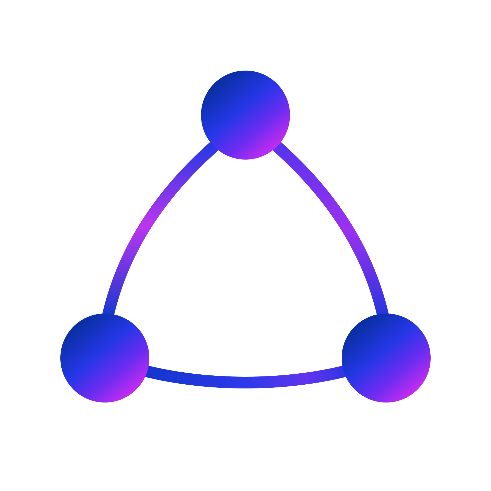

<p align="center">
  
</p>

<h1 align="center">Aegora</h1>

[English](./README.md)

**企业级 Agent 控制平面与无状态运行时**

Aegora 是一个面向企业场景的 AI Agent 平台，用于注册、治理、组合和运行 Agent、MCP 工具、工作流、长期记忆与组织级 Skill。平台以配置驱动的无状态 Runtime 为执行底座，通过可插拔 ExecutionEngine 与 MemoryProvider 解耦具体执行/记忆实现，并把权限、记忆策略、Skill 晋级和审计留在平台治理层。仓库采用 Monorepo 组织，同时保持控制平面与运行时数据平面可独立部署。

## 架构

下图描述的是 **目标生产架构**。PostgreSQL 始终是控制面事实源；Redis、Runtime 本地缓存、LiteLLM 路由和数据飞轮属于可演进的运行/治理层，不改变事实所有权。

```text
                           Aegora 控制平面
          Agent / Release / RBAC / MCP / Memory Policy / Skill Governance
                                  |
                                  v
                            PostgreSQL
                           控制面事实源
                                  |
                                  v
                               Redis
                      配置 L2 / 事件 / 失效通知
                                  |
                    +-------------+-------------+
                    |             |             |
                    v             v             v
               Runtime Pod 1 Runtime Pod 2 Runtime Pod 3
                 L1 Cache      L1 Cache      L1 Cache
                 MCP Pool      MCP Pool      MCP Pool
              ExecutionEngine ExecutionEngine ExecutionEngine
               MemoryService  MemoryService  MemoryService
                    |             |             |
                    +------+------+-+-----------+
                           |        |
                           v        v
                       LiteLLM   MemoryProvider
                         Proxy    Native PG / OpenViking
                           |
                  Router / Retry / Fallback
                           |
                           v
                    Model Providers
```

### Runtime 与缓存分层

Runtime 在持久业务事实和配置事实层面保持无状态，但允许保存 **可丢弃、可重建的加速状态**：

- **PostgreSQL — 唯一事实源**：保存 Agent 草稿/不可变 Release、RBAC、能力状态、MCP 注册信息、学习策略、审计记录等持久控制面数据。
- **Redis — 共享 L2 与事件层**：承载带版本号的 Runtime Context 缓存、失效/版本事件等可重建共享状态。当前 Roadmap 分支已落地 Release 发布/撤销与工具策略变更事件的 v1 契约、控制面 best-effort Publisher 和 Runtime Subscriber。Redis 不承担权威配置数据库职责。
- **Runtime L1 — 进程内热点缓存**：在 Redis L2 前缓存有界的不可变 Release 静态配置；使用版本化 Key 隔离不同 Release，且绝不缓存可变鉴权事实。
- **MCP Pool — 进程内连接复用**：每个 Runtime Pod 可复用 MCP Session/Connection，但池状态可随时丢弃并在重启后重建。
- **LiteLLM Proxy — 统一模型网关**：Runtime 与 Control Plane 统一通过 OpenAI-compatible 接口使用稳定的 `aegora-chat` / `aegora-fast` 别名，真实 Provider Key 与具体模型名收敛在 LiteLLM 后方；`deploy/` 已包含 Staging 部署接线。
- **Langfuse — Agent/LLM 可观测性**：Runtime 可选创建携带 Aegora trace/session/user 上下文的根 Span，LiteLLM 再通过 Langfuse OTEL 上报模型 Generation，使 Agent 执行与 token、延迟、成本等模型数据能够关联。
- **Prompt/KV Cache — 推理优化层（可选）**：仅用于降低推理成本和延迟，不能成为鉴权或业务状态来源。

目标配置读取链路是 **PostgreSQL -> Redis L2 -> Runtime L1**。Agent 发布、禁用或权限/策略变化时推进版本并发送失效事件；Runtime 在版本变化或缓存 Miss 后重新解析，而不是依赖长 TTL 保证正确性。

### 设计原则

- **控制面 / Runtime 分离**：配置与治理归控制面；生产执行归 Runtime，控制面不进入推理热路径。
- **业务执行无状态**：Runtime 可持有可丢弃的本地缓存和 MCP 连接池，但持久事实必须外置。
- **Release 驱动执行**：不可变 Agent Release 定义能力上限，运行时鉴权只能收紧，不能扩大该上限。
- **动态鉴权**：每次执行都取 Release 能力、当前能力状态、当前用户权限/Scope 的交集。
- **面向能力集成**：MCP 是主要工具协议；复杂 SOP/Workflow 应作为受治理能力暴露，而不是直接泄露底层 API。
- **集中配置**：控制面与 Runtime 默认读取仓库根目录 `.env`；真实密钥禁止提交到仓库。
- **记忆归平台治理**：Provider 负责存储/检索，Aegora 负责“该不该记、谁能看、是否共享、何时遗忘、能否晋级为 Skill”；外部 Memory Backend 不能绕过平台授权与发布门禁。

## 受治理的 Memory Plane

Aegora 将 **会话历史、执行 Checkpoint、长期记忆与可发布 Skill** 明确分层，而不是把它们混成一个“Memory”概念：

```text
Conversation History        当前会话上下文
        |
        +--> Checkpoint      LangGraph / HITL / 恢复执行
        |
        +--> MemoryService
               |
          MemoryProvider
          /            \
     Native PG      OpenViking
          |
   Governance / Policy
          |
   Episodic / Semantic
          |
   Procedural Memory
          |
      Governed Skill
```

当前 Memory Plane 已完成 P0–P6 主链：

- **可插拔 Provider**：`MEMORY_PROVIDER=native_pg|openviking`。默认仍使用 Native PostgreSQL；OpenViking 作为独立 HTTP Memory Backend 接入，不进入 Runtime Core。
- **多 Agent / 多租户作用域**：支持 `user_global`、`user_agent`、`tenant_user`；策略模式包括 `tenant_required`、`user_controlled`、`agent_private`，并对公有 Agent 额外收紧。
- **治理优先于检索**：Release、用户、租户策略决定可见范围，Provider 只返回候选；Aegora 在注入上下文前再次过滤、排序和控制预算。
- **后台自动提取**：用户显式、稳定、可复用的信息先进入 `memory_candidates`，再经过敏感信息、推断、冲突、来源可信度和阈值门禁，不能由 LLM 直接写成平台事实。
- **版本 / 冲突 / 遗忘 / 过期**：长期记忆保留 provenance、版本替换、显式遗忘、TTL/expiry 和 `memory_events` 审计链；企业事实不会被普通自动记忆覆盖。
- **OpenViking 适配**：Aegora 使用 trusted identity header 做 tenant/user/agent 身份映射，并兼容 `viking://~` 到 canonical URI、内置 memory type 目录及 overview/abstract 文档。
- **统一 Memory Eval**：同一评测集可切换 Provider，对 recall、distractor、privacy isolation、update、forget、candidate decision 和上下文预算做回归。

P5 已在隔离 WSL PostgreSQL + pgvector 上验证 migration 幂等和 Native PG 的 create → update → recall → forget → expiry → audit 全链路；OpenViking v0.4.21 也完成真实 HTTP/存储/检索链路验证。当前 OpenViking 评测使用测试 embedding，仅用于验证 Provider 契约与隔离语义，**不作为生产语义检索质量结论**。更详细的边界、SQL 与验证证据见 [`services/runtime/docs/architecture.md`](./services/runtime/docs/architecture.md)。

## 受治理的数据飞轮

Aegora 将运行经验视为 **候选改进素材**，而不是允许 Agent 在生产环境中静默自我修改。

```text
生产运行 / Trace / Memory Evidence / 人工反馈
                        |
                        v
                 Weekly Reflection
                        |
          重复成功模式 + 正/负反馈证据
                        |
                        v
                Procedural Memory
                        |
              Deterministic Gate
                        |
                        v
                   Skill Draft
                        |
             Offline Eval / Regression
                        |
                        v
                Canary / Shadow
                        |
                        v
                 Human Reviewer
                        |
                        v
                   Active Skill
                        |
                        v
                 新一轮生产运行
```

### 数据飞轮治理约束

- **证据与可执行变更分离**：Trace、反馈和评测可以生成提案，但提案本身不能直接修改生产行为。
- **可发布内容全部版本化**：Skill、Prompt、策略与 Agent Release 一旦发布即不可变，支持复现、审计和回滚。
- **先策略、后晋级**：按 Agent 配置学习策略，明确哪些数据可自动进入学习流程、哪些必须人工审核、哪些禁止学习。
- **质量门禁**：候选变更在发布前经过离线回归/评测；高风险变更可进一步走 Canary。
- **完整血缘**：保留来源 Run/证据、评测结果、变更提案、策略/人工决策以及最终生成版本之间的关联。
- **学习不能扩大权限**：新 Skill 或 Prompt 无法绕过已发布 Release 的能力上限，也不能绕过 Runtime 当前动态鉴权结果。

当前代码已经把这条飞轮推进到 **Memory → Reflection → Procedural Memory → Governed Skill**：Reflection 只聚合同一 Agent 且允许采集的证据；默认至少需要 3 条独立 trace、2 条正反馈、成功 Assistant 回复证据，并且不能存在超过策略阈值的负反馈冲突，才会形成可晋级的 Procedural Memory。候选按 `agent_id + fingerprint` 去重并保留 `source_trace_ids / positive_trace_ids / source_memory_candidate_ids` 血缘。通过 gate 也只能生成 `draft` Skill，后续仍必须经过绑定当前内容哈希的 Offline Eval、Regression、Canary/Shadow 和明确人工 Reviewer。若 Draft 生成后新的负反馈把 Procedural Memory 标记为 `conflicted`，Strapi→PostgreSQL 的 active 同步会重新查询当前治理状态并阻断发布。自动程序性学习默认关闭，只有显式启用后才参与 Reflection。真实受控流量自动生成 Canary 证据仍属于后续 Roadmap。

## 仓库结构

```text
Aegora/
├─ apps/control-plane/        # FastAPI 控制面 + React/Vite 控制台
├─ services/runtime/          # 无状态 Agent Runtime
├─ packages/config/           # 共享配置约定
├─ packages/contracts/        # 跨平面版本化契约
├─ deploy/                    # 仓库级部署边界
├─ docs/                      # 架构与迁移文档
├─ .env.example               # 统一配置模板
├─ README.md
└─ README_CN.md
```

## 本地开发

```bash
cp .env.example .env

# 配置 LITELLM_* 上游模型参数；启用 Trace 时再配置 Langfuse Key。
python -m pip install "litellm[proxy]"
litellm --config deploy/litellm-config.yaml --port 4000

cd apps/control-plane/backend
python -m pip install -r requirements.txt
uvicorn app.main:app --host 127.0.0.1 --port 8000

cd apps/control-plane/frontend
npm install
npm run dev -- --host 127.0.0.1 --port 5173

cd services/runtime
python -m pip install -r requirements.txt
PYTHONPATH=src uvicorn apps.api_app:app --host 127.0.0.1 --port 5000
```

## 当前迁移状态与 Roadmap

当前 Monorepo 是既有 Agent Platform 与 Agentic RAG Runtime 的整合后继版本。新的跨平面能力应依赖 `packages/contracts` 中的版本化契约，而不是跨应用直接导入实现代码。

下一步重点：

1. Workflow Capability 已补齐首轮治理编辑与版本生命周期基础：管理员可以基于已有 MCP Connection 注册受治理工作流能力，Runtime 复用 MCP 执行适配器并保留 `source=workflow` 语义；控制台支持显式编辑 Input Schema、Scope allow-list Schema 与 Scope 描述。发布时会把 `workflow_id + version` 固化为不可变版本事实，同一 Workflow 同时最多一个 `active` 版本，新版本发布会把旧版本转为 `retired` 并更新 `tools` 运行投影；管理员 API 可列出历史版本并退役指定版本。下一步补充版本历史/退役的前端管理体验，以及更完整的 draft/canary 生命周期。
2. 继续硬化 LiteLLM / Langfuse 生产链路：锁定验证过的镜像 Digest，增加多 Provider Fallback、预算策略与 Trace/Eval 看板。
3. Redis 缓存第一/二阶段与事件层第一阶段已在 Roadmap 分支落地：Runtime 仅缓存不可变 Release `config_json`，链路为有界进程内 L1 + 版本化 Redis L2；Control Plane 发布版本化的发布/撤销/工具策略事件，Runtime 订阅并对相关 Release 精确失效。Runtime Prometheus 已补充 applied/ignored/invalid 事件计数、事件消费延迟和订阅重连失败指标；Control Plane 也增加了低基数的发布成功/失败/禁用计数，并通过管理员运维接口暴露当前 Publisher 状态。Release 状态、RBAC、工具状态与 MCP Connection 状态仍实时读取 PostgreSQL。下一步仅在确认存在真实 stale MCP Session 风险时再增加定向 Session 收敛动作。
4. 受治理学习已完成 P6 主链：Memory Evidence → Reflection → Procedural Memory → Skill Draft → Eval/Regression → Canary → Human Review → Active Skill，并加入去重、负反馈冲突、live procedural state 重检与完整 lineage。下一步从真实受控的 shadow/limited 流量自动生成 Canary 证据，并扩展真实多轮数据集评测。
5. Memory Provider 当前以 Native PG 为默认后端，OpenViking 保持可插拔实验 Provider。下一步接入真实 embedding 做同口径 A/B，并在需要多副本部署时验证 OpenViking 的共享存储/索引、HA 与容量边界，而不是仅以“能启动多个 Pod”作为集群成熟度结论。
