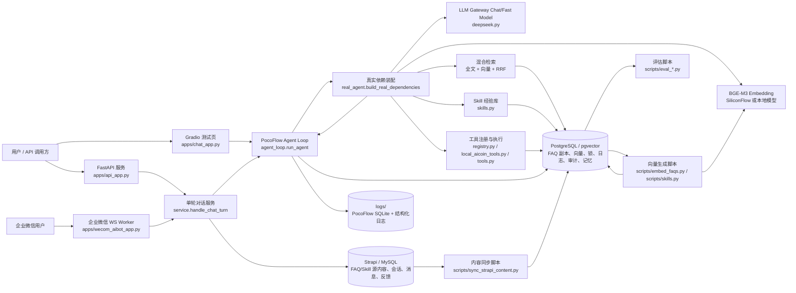
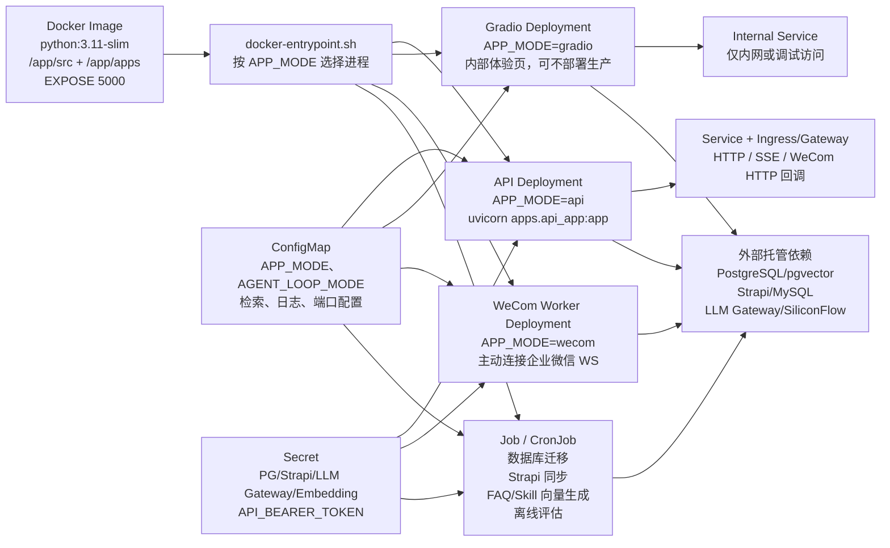
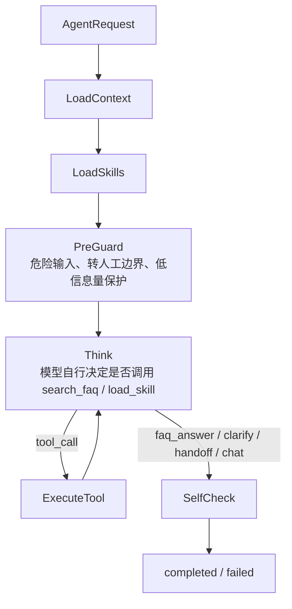

# Aegora Runtime 项目架构图

> 基于当前代码和配置整理：`apps/` 是入口层，`src/aegora_runtime/` 是运行时核心，`scripts/` 是同步、嵌入、迁移和评估工具。

## 总体架构



## 在线请求链路

```mermaid
sequenceDiagram
    participant Client as 调用方
    participant Entry as apps 入口
    participant Service as service.py
    participant Session as sessions.py
    participant Loop as agent_loop.py
    participant Real as real_agent.py
    participant PG as PostgreSQL/pgvector
    participant Strapi as Strapi
    participant LLM as LLM Gateway
    participant Emb as Embedding API

    Client->>Entry: 发送 message + session_id
    Entry->>Service: ChatTurnInput
    Service->>Session: normalize_session_id + 会话锁
    Session->>PG: pg_advisory_lock
    Service->>Session: 读取最近 20 条消息
    Session->>Strapi: chat_messages
    Service->>Loop: run_agent
    Loop->>Real: load_context / load_skills / think / tools
    Real->>PG: 读取 Skill、FAQ、全文索引、向量表
    Real->>Emb: 查询向量
    Real->>LLM: 分类、规划、回答、自检可选
    Loop->>PG: 工具日志 / 审计日志 / PocoFlow 观测
    Loop-->>Service: answer + route + evidence + trace
    Service->>Session: 保存 user/assistant 消息
    Session->>Strapi: chat_sessions / chat_messages
    Session->>PG: pg_advisory_unlock
    Service-->>Entry: 结构化响应
    Entry-->>Client: answer / stream / markdown
```

## Agent Loop

当前在线 Agent flow 统一使用 `planner`。旧的先分类再检索 router flow 已不再作为运行入口。

## Docker / K8s 部署视图

当前仓库有 `Dockerfile` 和 `docker-entrypoint.sh`，未发现 K8s YAML。下面表达的是基于现有 Docker 入口能自然拆出的部署拓扑，不表示仓库已经包含这些 manifests。



部署边界：

- API 是可水平扩展的 HTTP 服务，前面放 Service 和 Ingress/Gateway。
- WeCom worker 是长连接进程，主动连企业微信 WS，通常不需要 Service。
- Gradio 是内部体验/调试入口，生产环境可以不部署或只暴露内网。
- 迁移、内容同步、向量生成和离线评估适合 K8s Job/CronJob，不应塞进 API Pod 启动路径。
- 配置走 ConfigMap，密钥走 Secret；外部依赖仍是 PG、Strapi、LLM Gateway、Embedding API。

### planner



## 模块边界

| 层级 | 主要文件 | 职责 |
| --- | --- | --- |
| 入口层 | `apps/api_app.py`, `apps/chat_app.py`, `apps/wecom_aibot_app.py` | HTTP、Gradio、企业微信接入；不承载核心决策 |
| 服务层 | `src/aegora_runtime/service.py` | 标准化单轮请求、会话锁、读历史、跑 Agent、保存结果 |
| 编排层 | `src/aegora_runtime/agent_loop.py` | PocoFlow planner flow、工具循环、自检、观测事件 |
| 依赖层 | `src/aegora_runtime/real_agent.py` | 装配 LLM Gateway、Embedding、检索、Skill、工具和自检逻辑 |
| 检索层 | `src/aegora_runtime/retrieval.py`, `src/aegora_runtime/demo_agent.py` | PG 全文检索、pgvector 检索、RRF 融合、Embedding 降级 |
| 工具层 | `src/aegora_runtime/registry.py`, `src/aegora_runtime/local_aicoin_tools.py`, `src/aegora_runtime/tools.py` | 工具注册、参数校验、并行/串行执行、工具日志 |
| 会话层 | `src/aegora_runtime/sessions.py`, `src/aegora_runtime/strapi.py` | 会话续读、消息保存、反馈保存；内容走 Strapi API |
| 数据层 | `src/aegora_runtime/db.py`, `scripts/db_migrate.py` | PG 连接、schema、pgvector、中文全文检索函数 |
| 离线任务 | `scripts/sync_strapi_content.py`, `scripts/embed_faqs.py`, `scripts/eval_*.py` | 内容同步、向量生成、检索/回答质量评估 |

## 关键边界

- FAQ 和 Skill 源内容由 Strapi 管理；运行时检索副本和向量在 PostgreSQL/pgvector。
- 会话、消息、反馈通过 Strapi 保存；并发会话锁、工具日志、审计日志、记忆写 PostgreSQL。
- `planner` 让模型通过已注入工具自行检索；请求侧不携带工具权限事实。
- Embedding API 不可用时，FAQ 检索可降级为全文检索；Skill 自动召回会跳过。
- 工具只有全部只读且 `parallel_safe` 时才批量并行，写工具混入时串行执行。
