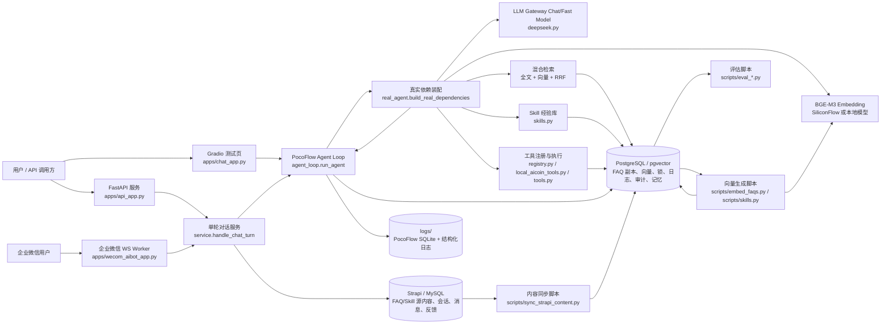
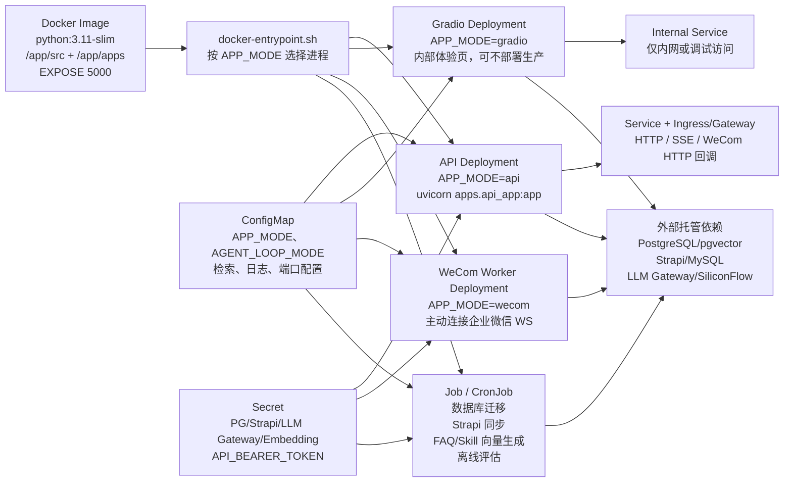
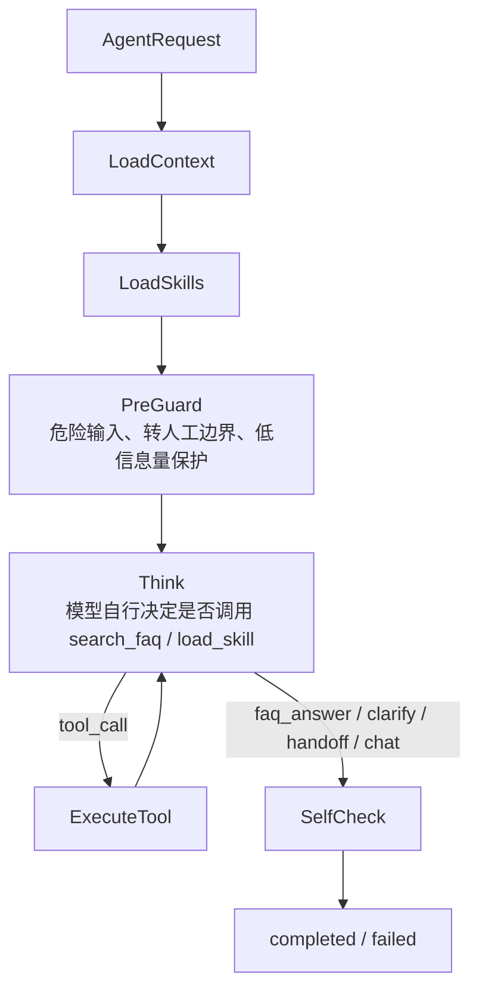

# Aegora Runtime 项目架构图

> 基于当前代码和配置整理：`apps/` 是入口层，`src/aegora_runtime/` 是运行时核心，`scripts/` 是同步、嵌入、迁移和评估工具。

## 总体架构


```mermaid
flowchart LR
    user["用户 / API 调用方"]
    wecom_user["企业微信用户"]
    gradio["Gradio 测试页\napps/chat_app.py"]
    api["FastAPI 服务\napps/api_app.py"]
    wecom["企业微信 WS Worker\napps/wecom_aibot_app.py"]

    service["单轮对话服务\nservice.handle_chat_turn"]
    deps["真实依赖装配\nreal_agent.build_real_dependencies"]
    loop["PocoFlow Agent Loop\nagent_loop.run_agent"]

    deepseek["LLM Gateway Chat/Fast Model\ndeepseek.py"]
    embedding["BGE-M3 Embedding\nSiliconFlow 或本地模型"]
    tools["工具注册与执行\nregistry.py / local_aicoin_tools.py / tools.py"]
    retrieval["混合检索\n全文 + 向量 + RRF"]
    skills["Skill 经验库\nskills.py"]

    pg[("PostgreSQL / pgvector\nFAQ 副本、向量、锁、日志、审计、记忆")]
    strapi[("Strapi / MySQL\nFAQ/Skill 源内容、会话、消息、反馈")]
    logs[("logs/\nPocoFlow SQLite + 结构化日志")]

    sync["内容同步脚本\nscripts/sync_strapi_content.py"]
    embed["向量生成脚本\nscripts/embed_faqs.py / scripts/skills.py"]
    evals["评估脚本\nscripts/eval_*.py"]

    user --> gradio
    user --> api
    wecom_user --> wecom

    gradio --> loop
    api --> service
    wecom --> service
    service --> loop

    deps --> loop
    loop --> deps
    deps --> deepseek
    deps --> embedding
    deps --> tools
    deps --> retrieval
    deps --> skills

    retrieval --> pg
    skills --> pg
    tools --> pg
    service --> strapi
    loop --> logs
    loop --> pg

    strapi --> sync --> pg
    pg --> embed --> embedding
    embed --> pg
    pg --> evals
```

## 在线请求链路

```mermaid
sequenceDiagram
    participant Client as 调用方
    participant Entry as apps 入口
    participant Service as service.py
    participant Session as sessions.py
    participant Loop as agent_loop.py
    participant Real as real_agent.py
    participant PG as PostgreSQL/pgvector
    participant Strapi as Strapi
    participant LLM as LLM Gateway
    participant Emb as Embedding API

    Client->>Entry: 发送 message + session_id
    Entry->>Service: ChatTurnInput
    Service->>Session: normalize_session_id + 会话锁
    Session->>PG: pg_advisory_lock
    Service->>Session: 读取最近 20 条消息
    Session->>Strapi: chat_messages
    Service->>Loop: run_agent
    Loop->>Real: load_context / load_skills / think / tools
    Real->>PG: 读取 Skill、FAQ、全文索引、向量表
    Real->>Emb: 查询向量
    Real->>LLM: 分类、规划、回答、自检可选
    Loop->>PG: 工具日志 / 审计日志 / PocoFlow 观测
    Loop-->>Service: answer + route + evidence + trace
    Service->>Session: 保存 user/assistant 消息
    Session->>Strapi: chat_sessions / chat_messages
    Session->>PG: pg_advisory_unlock
    Service-->>Entry: 结构化响应
    Entry-->>Client: answer / stream / markdown
```

## Agent Loop

当前在线 Agent flow 统一使用 `planner`。旧的先分类再检索 router flow 已不再作为运行入口。

## 长期记忆边界（Memory Plane P0-P6）

长期记忆与会话历史、执行 Checkpoint 分离：会话历史仍由 `sessions.py`/Strapi 管理，LangGraph Checkpoint 只保存执行状态；长期事实和经验统一通过 `MemoryService -> MemoryProvider` 访问。Runtime 数据库中的 `memory_items` 是记忆内容事实源，Control Plane 中的 namespace policy 与用户 sharing preference 是共享治理事实源。

```text
Control Plane
  Memory Namespace Policy ─────┐
  User Sharing Preference ─────┼──> Effective Memory Governance
                               │
Runtime                        v
Configured Runner ───────> MemoryService
Local Memory Tool ───────> MemoryProvider
                               |
                               v
                     NativePgMemoryProvider
                               |
                         memory_items
                         (versioned)
```

### 多 Agent 记忆模型

同一用户使用多个公有/私有 Agent 时不复制整份用户画像，而使用“共享 Core + Agent Overlay”：

- `user_global`：用户 canonical memory core。来源 Agent 始终可以读取自己产生的事实；其他 Agent 是否可读由用户对该 namespace 的共享偏好决定。
- `user_agent`：Agent 私有 overlay，只允许同一 Agent 读取，适合专属工作习惯、私有上下文。
- `tenant_user`：企业治理事实，如部门、岗位、组织身份；仅 namespace policy 为 `tenant_required` 时进入有效召回。
- public Agent 默认不能消费跨 Agent/企业记忆；管理员必须在对应 namespace 上显式配置 `allow_public_agents=true`。

Namespace policy 有三种模式：

- `tenant_required`：管理员治理，用户不能通过 sharing toggle 关闭；普通 Agent 也不能用 `save_user_memory` 伪造这一类事实。
- `user_controlled`：用户决定是否跨 Agent 分享。
- `agent_private`：写入 `user_agent` overlay，禁止跨 Agent 分享。

Effective Recall 不是 Provider 自己决定，而是候选记忆经过 Aegora policy 过滤后形成：

```text
Effective Memory
= Tenant-required Memory
+ User-authorized Global Memory
+ Current Agent Overlay
```

### 版本、来源与兼容

`memory_items` 保存 `source_agent_id / source_session_id / source_trace_id`、版本号、`supersedes_id` 和有效时间。相同 identity 的新事实不会覆盖旧行，而是将旧版本标记为 `superseded`，保留审计链。旧 `user_memories.facts` 在迁移时会自动 backfill 到 `memory_items`，且 P2 期间 `user_global/preferences` 写入继续双写兼容表，避免已有数据和旧调用方失效。

- `save_user_memory` 优先使用请求中的稳定 `user_id`；匿名请求仍退化为 session-owner 身份。
- 自动 recall 由 `MEMORY_RECALL_ENABLED` 灰度控制；`AEGORA_TENANT_ID` 决定 Runtime 查询哪个 tenant 的治理事实。
- Provider recall 失败采用 fail-open；Control Plane policy 读取失败采用 fail-closed，不扩大跨 Agent 共享范围。
- Native PG recall 会先取较大的候选池，再在 MemoryService 做 provider-neutral 的轻量 relevance/importance/confidence 排序；这不是 embedding 语义检索，后续 Provider 可以替换更强检索实现。

### P4：后台提取、冲突治理与遗忘

自动记忆不进入在线回答热路径。会话仍先正常落 Strapi，DataOps 后台任务再消费最近的**用户原话**，LLM 只生成 `MemoryCandidate`，Aegora 自己的 deterministic policy 决定是否写入：

```text
User Turn in Strapi
       |
       v
DataOps memory_extraction
       |
       v
LLM Candidate Extraction
       |
       v
memory_candidates (pending)
       |
       v
Aegora Governance / Conflict Resolver
   |          |           |
 applied   needs_review  rejected
   |
   v
MemoryProvider.remember / forget
   |
   v
memory_items + memory_events
```

关键约束：

- `MEMORY_EXTRACTION_ENABLED=false` 默认关闭；管理员先配置 namespace policy，再开启后台自动提取。
- 自动提取只允许明确用户事实/偏好；推断型候选、敏感信息、`tenant_required` namespace 自动拒绝。
- 自动候选可以更新自动记忆；若与 `source_kind=explicit` 的用户显式记忆冲突，没有明确 `update_intent` 时进入 `needs_review`，不会静默覆盖。
- 自动 `forget` 只接受用户明确的遗忘指令，并使用独立的高阈值 `MEMORY_FORGET_THRESHOLD`。
- `valid_until` 已成为真实生命周期边界：Recall 直接排除到期项，后台 sweep 将其标记为 `expired`。
- 所有候选决策以及 `created / updated / superseded / forgotten / expired` 生命周期事件写入 `memory_events`，保留 trace、Agent、Session 和原因。
- `memory_extraction_messages` 以 `trace_id` 做幂等；已完成的用户消息不会反复提取。
- Control Plane policy 不可用时，后台 extraction 跳过写入，而不是套默认策略继续学习。

### Memory Eval

P4 增加固定 JSONL seed 与 provider-neutral evaluator，用同一套场景验证 Native PG，后续也可直接比较 OpenViking/Mem0 等 Provider。当前覆盖：

- query-relevant recall 与 distractor rejection；
- 多 Agent / public-private 隔离；
- 用户授权共享；
- tenant policy 不会把历史 user memory 自动“升格”为企业事实；
- 显式事实更新与冲突 review；
- forget 正确性；
- injected memory context 字符预算。

运行：

```bash
cd services/runtime
PYTHONPATH=src python scripts/eval_memory.py --dataset evals/memory_eval_seed.jsonl
```

这套 seed 是**治理/生命周期回归基线**，不是生产语义检索质量的统计结论；接入外部 Provider 后应继续扩展真实多轮会话样本，再比较 recall quality、错误注入率、上下文成本和延迟。

### P5：真实 PostgreSQL 与 OpenViking Provider

P5 把 MemoryProvider 的抽象落到两个真实后端，并保持治理边界不变：

- `native_pg`：Aegora 自己维护 `memory_items / memory_events / memory_candidates`，作为默认 Provider。
- `openviking`：通过 HTTP 适配 `content/write`、`search/find`、`content/read` 与 `fs` 删除；Aegora 仍负责 scope、namespace policy、冲突仲裁、候选提取和注入预算。
- `MEMORY_PROVIDER=native_pg|openviking` 只切换存储/检索实现，不改变 ExecutionEngine，也不把 OpenViking 的自动记忆策略变成平台事实。
- OpenViking trusted mode 使用服务端可信的 `X-OpenViking-Account / User / Actor-Peer` 身份头。`viking://~` 已经是用户作用域别名，因此 Aegora 不再把 tenant/user 重复编码进 URI。
- Aegora logical namespace 映射到 OpenViking 内置 memory type 根：`preferences -> ~/memories/preferences/`，其他结构化事实进入 `~/memories/entities/`；具体 Aegora namespace/scope 继续保存在文档 metadata 和子目录中。
- OpenViking 搜索会返回 canonical `viking://user/<id>/...` URI 以及自动生成的 `.overview.md/.abstract.md`；Provider 必须接受 alias→canonical 展开，并跳过非 Aegora 文档，单个坏 hit 不得让整轮 Recall 失败。
- `memory_id` 使用 Aegora 自己的 tenant/user scoped stable id，避免不同用户的 `viking://~` 别名在上层被误认为同一条记忆。
- Provider 不可用时仍沿用 `MemoryService` fail-open 语义，不阻断 Agent 主流程。

真实集成验证：

```bash
# Native PG（隔离 WSL PostgreSQL + pgvector）
AEGORA_TEST_PG_INTEGRATION=1 \
PG_HOST=127.0.0.1 PG_PORT=55432 PG_DATABASE=postgres \
PG_USER=aegora_runtime PG_PASSWORD=... PG_SSLMODE=disable \
python -m pytest tests/test_memory_pg_integration.py -q

# 同一评测集切 Provider
PYTHONPATH=src python scripts/eval_memory_provider.py \
  --provider native_pg \
  --dataset evals/memory_eval_seed.jsonl

PYTHONPATH=src python scripts/eval_memory_provider.py \
  --provider openviking \
  --dataset evals/memory_eval_seed.jsonl
```

本轮 WSL 实测：

- Runtime schema migration 在 PostgreSQL + pgvector 上连续执行两次成功，验证幂等；
- Native PG create → version update → recall → forget → expiry → `memory_events` 审计链通过；
- 9-case Native PG baseline：`recall_relevance=1.0`；
- OpenViking v0.4.21 的真实 HTTP/存储/检索链已跑通；在隔离测试用 mock embedding 下 `recall_relevance=0.8571`，其余 distractor/privacy/update/forget/candidate/context-budget 指标均为 `1.0`。

OpenViking 的 `0.8571` **不是生产语义检索质量结论**。该服务本轮为了隔离验证 HTTP/身份/索引语义，使用了测试 embedding；正式 A/B 必须接真实 embedding 模型并扩展真实多轮会话数据后再比较质量、延迟和成本。当前默认 Provider 仍保持 `native_pg`。

### P6：Memory → Reflection → Procedural Memory → Governed Skill

P6 不创建第二套学习系统，而是把 Memory Plane 的证据接入既有 Weekly Reflection / Skill Draft / Eval / Canary / Human Review 链：

```text
Conversation / Memory Evidence
          |
          v
   Weekly Reflection
          |
  repeated + positive feedback
  same Agent + learning policy
          |
          v
  procedural_memories
 candidate / blocked / conflicted
          |
 deterministic promotion gate
          v
      Skill Draft
          |
   Offline Eval + Regression
          |
      Canary / Shadow
          |
     Human Reviewer
          |
          v
       Active Skill
```

核心规则：

- 程序性记忆是 **Agent 级经验**，不是用户画像；`procedural_memories` 按 `agent_id + fingerprint` 去重。
- Reflection 只使用允许 `capture_evidence` 的会话；不同 Agent 的证据永不聚合。
- P6 的成功模式必须同时满足重复次数、正反馈数量、成功 Assistant 回复证据以及 Agent 的 `propose_skills` 学习策略。
- 默认 gate：至少 3 条独立 trace、至少 2 条 positive feedback、负反馈比例不高于 0；阈值由 `DATA_OPS_PROCEDURAL_*` 配置。
- 正反馈只证明“该处理模式值得形成候选”，不会直接发布 Skill；敏感证据、legacy Agent、证据不足、负反馈冲突都会进入 `blocked`。
- 每条 Procedural Memory 保留 `source_trace_ids / positive_trace_ids / source_memory_candidate_ids / successful_response_examples`，把会话、Memory Candidate 与后续 Skill Draft 串成完整 lineage。
- Procedural Skill Draft metadata 保存 `procedural_memory_id / fingerprint / source_agent_id / evidence counts`，且 `lifecycle_status` 固定为 `draft`。
- 同一 procedural fingerprint 已经生成 Draft 后，Weekly Reflection 不重复生成。后续如果观察到冲突负反馈，状态从 `skill_drafted` 转为 `conflicted`。
- Strapi → PG 的 active Skill 同步会重新读取当前 `procedural_memories` 状态；若已 `conflicted / blocked / rejected`，即使旧 Eval/Canary 证据仍在，也拒绝晋级。
- 最终 active 仍必须通过原有 `agent_skill_promotion_errors()`：Offline Eval、Regression、Canary、最新 content hash 和明确 `reviewed_by` 缺一不可。

默认关闭自动程序性学习，启用前需显式配置：

```env
DATA_OPS_PROCEDURAL_ENABLED=true
DATA_OPS_PROCEDURAL_MIN_OCCURRENCES=3
DATA_OPS_PROCEDURAL_MIN_POSITIVE_FEEDBACK=2
DATA_OPS_PROCEDURAL_MAX_NEGATIVE_RATIO=0.0
```

因此 P6 中 Memory 与 Skill 的边界是：**Memory 保存经验，Procedural Memory 聚合可复用模式，Skill 是经过评测、Canary 和人工审核后才发布的治理能力。**

## Docker / K8s 部署视图

当前仓库有 `Dockerfile` 和 `docker-entrypoint.sh`，未发现 K8s YAML。下面表达的是基于现有 Docker 入口能自然拆出的部署拓扑，不表示仓库已经包含这些 manifests。


```mermaid
flowchart LR
    image["Docker Image\npython:3.11-slim\n/app/src + /app/apps\nEXPOSE 5000"]
    entry["docker-entrypoint.sh\n按 APP_MODE 选择进程"]

    api["API Deployment\nAPP_MODE=api\nuvicorn apps.api_app:app"]
    svc["Service + Ingress/Gateway\nHTTP / SSE / WeCom HTTP 回调"]

    gradio["Gradio Deployment\nAPP_MODE=gradio\n内部体验页，可不部署生产"]
    gradio_svc["Internal Service\n仅内网或调试访问"]

    wecom["WeCom Worker Deployment\nAPP_MODE=wecom\n主动连接企业微信 WS"]

    jobs["Job / CronJob\n数据库迁移\nStrapi 同步\nFAQ/Skill 向量生成\n离线评估"]

    config["ConfigMap\nAPP_MODE、AGENT_LOOP_MODE\n检索、日志、端口配置"]
    secret["Secret\nPG/Strapi/LLM Gateway/Embedding\nAPI_BEARER_TOKEN"]

    external["外部托管依赖\nPostgreSQL/pgvector\nStrapi/MySQL\nLLM Gateway/SiliconFlow"]

    image --> entry
    entry --> api --> svc
    entry --> gradio --> gradio_svc
    entry --> wecom
    entry --> jobs

    config --> api
    config --> gradio
    config --> wecom
    config --> jobs
    secret --> api
    secret --> wecom
    secret --> jobs

    api --> external
    gradio --> external
    wecom --> external
    jobs --> external
```

部署边界：

- API 是可水平扩展的 HTTP 服务，前面放 Service 和 Ingress/Gateway。
- WeCom worker 是长连接进程，主动连企业微信 WS，通常不需要 Service。
- Gradio 是内部体验/调试入口，生产环境可以不部署或只暴露内网。
- 迁移、内容同步、向量生成和离线评估适合 K8s Job/CronJob，不应塞进 API Pod 启动路径。
- 配置走 ConfigMap，密钥走 Secret；外部依赖仍是 PG、Strapi、LLM Gateway、Embedding API。

### planner


```mermaid
flowchart TD
    start["AgentRequest"]
    load_context["LoadContext"]
    load_skills["LoadSkills"]
    pre_guard["PreGuard\n危险输入、转人工边界、低信息量保护"]
    think["Think\n模型自行决定是否调用 search_faq / load_skill"]
    tool["ExecuteTool"]
    self_check["SelfCheck"]
    done["completed / failed"]

    start --> load_context --> load_skills --> pre_guard --> think
    think -- tool_call --> tool --> think
    think -- faq_answer / clarify / handoff / chat --> self_check --> done
```

## 模块边界

| 层级 | 主要文件 | 职责 |
| --- | --- | --- |
| 入口层 | `apps/api_app.py`, `apps/chat_app.py`, `apps/wecom_aibot_app.py` | HTTP、Gradio、企业微信接入；不承载核心决策 |
| 服务层 | `src/aegora_runtime/service.py` | 标准化单轮请求、会话锁、读历史、跑 Agent、保存结果 |
| 编排层 | `src/aegora_runtime/agent_loop.py` | PocoFlow planner flow、工具循环、自检、观测事件 |
| 依赖层 | `src/aegora_runtime/real_agent.py` | 装配 LLM Gateway、Embedding、检索、Skill、工具和自检逻辑 |
| 检索层 | `src/aegora_runtime/retrieval.py`, `src/aegora_runtime/demo_agent.py` | PG 全文检索、pgvector 检索、RRF 融合、Embedding 降级 |
| 工具层 | `src/aegora_runtime/registry.py`, `src/aegora_runtime/local_aicoin_tools.py`, `src/aegora_runtime/tools.py` | 工具注册、参数校验、并行/串行执行、工具日志 |
| 会话层 | `src/aegora_runtime/sessions.py`, `src/aegora_runtime/strapi.py` | 会话续读、消息保存、反馈保存；内容走 Strapi API |
| 记忆层 | `src/aegora_runtime/memory/` | 长期记忆统一接口、Provider 适配、fail-open recall；与 ExecutionEngine 解耦 |
| 数据层 | `src/aegora_runtime/db.py`, `scripts/db_migrate.py` | PG 连接、schema、pgvector、中文全文检索函数 |
| 离线任务 | `scripts/sync_strapi_content.py`, `scripts/embed_faqs.py`, `scripts/eval_*.py` | 内容同步、向量生成、检索/回答质量评估 |

## 关键边界

- FAQ 和 Skill 源内容由 Strapi 管理；运行时检索副本和向量在 PostgreSQL/pgvector。
- 会话、消息、反馈通过 Strapi 保存；并发会话锁、工具日志、审计日志、长期记忆写 PostgreSQL。长期记忆通过 `MemoryProvider` 访问，不能与 LangGraph Checkpoint 混为一层。
- `planner` 让模型通过已注入工具自行检索；请求侧不携带工具权限事实。
- Embedding API 不可用时，FAQ 检索可降级为全文检索；Skill 自动召回会跳过。
- 工具只有全部只读且 `parallel_safe` 时才批量并行，写工具混入时串行执行。
